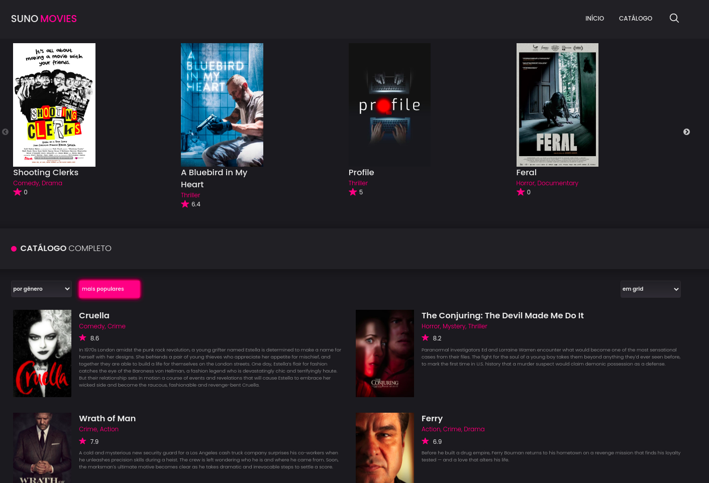

<!--
*** Template adatpet from: https://github.com/othneildrew/Best-README-Template
***
-->

<!-- PROJECT LOGO -->
<br />
<p align="center">
  <a href="https://github.com/flpnascto/movies-react">
    
  </a>

  <h3 align="center">React Movies</h3>

  <p align="center">
    Site de exibição de informações básicas sobre filmes, obtidos a partir da API <a href="https://www.themoviedb.org/">TMDb</a>.
    <br />
    <a href="https://github.com/flpnascto/movies-react">View Demo</a>
    ·
    <a href="https://github.com/flpnascto/movies-react/issues">Report Bug</a>
    ·
    <a href="https://github.com/flpnascto/movies-react/issues">Request Feature</a>
  </p>
</p>

<!-- TABLE OF CONTENTS -->
<details open="open">
  <summary><h2 style="display: inline-block">Tabela de Conteúdos</h2></summary>
  <ol>
    <li>
      <a href="#notebook_with_decorative_cover-sobre-o-projeto">Sobre o Projeto</a>
      <ul>
        <li><a href="#sparkles-funcionalidades">Funcionalidades</a></li>
        <li><a href="#computer-tecnologias-aplicadas">Tecnologias Aplicadas</a></li>
        <li><a href="#art-layout">Layout Base</a></li>
      </ul>
    </li>
    <li>
      <a href="#executando-a-aplicação">Executando a aplicação</a>
      <ul>
        <li><a href="#pré-requisitos">Pré-requisitos</a></li>
        <li><a href="#instalação">Instalação</a></li>
      </ul>
    </li>
    <li><a href="#handshake-contribuição">Contribuição</a></li>
    <li><a href="#memo-licença">Licença</a></li>
    <li><a href="#email-contato">Contato</a></li>
  </ol>
</details>

<!-- ABOUT THE PROJECT -->
## :notebook_with_decorative_cover: Sobre o Projeto



React Movies é um software baseado em Web com o objetivo de trazer informações aos  usuários acerca de filmes. Nestas informções estão contidos o `Título`, `Gênero`, `Rating` e `Sinopse` do filme. Além disto pode conter o `Folder` e o `Trailer`.

Esta informações são obtidas através de requisições à API The Movie DB.

Este projeto foi desenvolvido para o desafio técnido da [Suno Research](https://www.suno.com.br/). Verifique a [documentação](./challenge_description.md).

### :sparkles: Funcionalidades
- Exibição de um carrossel com os filmes mais recentes
- Catálogo de filmes com exibição em lista ou coluna
- Página de detalhes do filme, com trailer (se existir)
- Filtrar catálogo de filmes por gênero
- Ordenação catálogo de filmes por melhor avaliação

### :computer: Tecnologias Aplicadas

* HTML5
* CSS3
* JavaScript
* React
* Context API

### :art: Layout
Layout base disponível no [Figma](https://www.figma.com/file/V1Qfp19RorvXZI1qshlLGL/Suno-Movies?node-id=0%3A1)

<!-- GETTING STARTED -->
## Executando a aplicação

Para executar a aplicação localmente siga as instruções abaixo

### Pré-requisitos

Primeiramente é necessário que possua instalado as seguintes ferramentas: gerenciador de pacotes NPM e o Git.
Além disto é bom ter um editor para trabalhar com o código como VSCode.

### Instalação

1. Faça uma cópia do repositório (HTTPS ou SSH)
   ```sh
   git clone https://github.com/flpnascto/movies-react.git
   ```

   ```sh
   git@github.com:flpnascto/movies-react.git
   ```

2. Acesse a pasta do repositório loca e instale os pacotes necessários

   ```sh
   npm install
   ```

3. Na pasta do repositócio local execute o comando para iniciar a aplicação
   ```sh
   npm start
   ```
<!-- USAGE EXAMPLES -->
<!-- ROADMAP -->
<!-- CONTRIBUTING -->
## :handshake: Contribuição

As contribuições são o que tornam a comunidade open source um lugar incrível para aprender, inspirar e criar. :rocket: Juntos vamos mais longe.
Sinta-se a vontade para sugerir melhorias e compartilhar o conhecimento.

1. Fork o projeto
2. Crie sua _Feature Branch_ (`git checkout -b feature/AmazingFeature`)
3. _Commit_ suas alterações (`git commit -m 'Add some AmazingFeature'`)
4. _Push_ para o repositório remoto (`git push origin feature/AmazingFeature`)
5. Abra um _Pull Request_

<!-- LICENSE -->
## :memo: Licença
Esse projeto está sob a licença MIT. Veja o arquivo [LICENSE](LICENSE) para mais detalhes.

<!-- CONTACT -->
## :email: Contato

[](https://www.linkedin.com/in/fnascto/) [](mailto:flpnascto@gmail.com)
[](https://github.com/flpnascto)

Project Link: [https://github.com/flpnascto/movies-react](https://github.com/flpnascto/movies-react)
